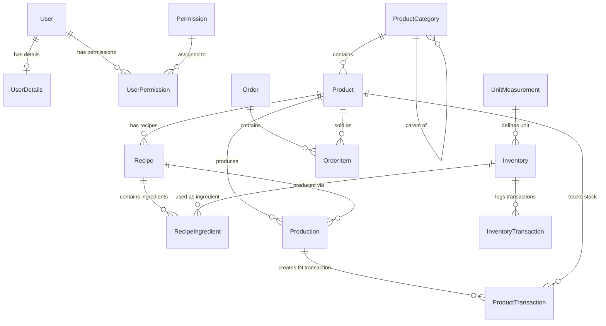
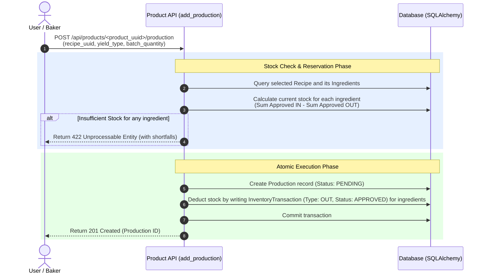

# Bakery App System Architecture & Development Brain

This document serves as a comprehensive system guide and "brain" for AI agents and developers. It details the architecture, data models, core workflows, and development guidelines for the Bakery App.

---

## 1. System Overview & Tech Stack

The Bakery App is a small, modular full-stack application structured into two main components:

- **Backend**: Python 3 Web API powered by **Flask**. 
  - **ORM & DB**: SQLAlchemy with SQLite/Postgres backend managed via **Flask-SQLAlchemy** and **Flask-Migrate** (Alembic).
  - **Auth**: JWT tokens via **Flask-JWT-Extended** and password hashing via **Flask-Bcrypt**.
  - **CORS**: Enabled via **Flask-CORS** to allow cross-origin React frontend requests.
- **Frontend**: A modern **React** application built using Vite, TypeScript, and TailwindCSS.
  - **Structure**: Grouped into routes, pages, components, config, and state managers.

---

## 2. Database Schema & Relationships

The following entity-relationship diagram shows how the system models are structured and interrelated.

### Models Directory Links
- [User Model](file:///home/chafi/bakery-app/backend/app/models/user.py)
- [Product Model](file:///home/chafi/bakery-app/backend/app/models/product.py)
- [Inventory Model](file:///home/chafi/bakery-app/backend/app/models/inventory.py)
- [Order Model](file:///home/chafi/bakery-app/backend/app/models/order.py)
- [Settings Model](file:///home/chafi/bakery-app/backend/app/models/settings.py)

---

## 3. Core Business Workflows

### 3.1. Production Workflow & Stock Reservation
The production flow is the link between the **Inventory** (raw materials) and **Products** (sellable goods).

Once production is completed:
1. The user updates status to `completed` via `PUT /api/products/<product_uuid>/production/<prod_uuid>`.
2. The API sets `produced_at = datetime.utcnow()`.
3. The API **automatically inserts a `ProductTransaction`** of type `IN` matching the produced quantity (1.0 for `single` yield type, or the `batch_quantity` for `batch` yield type). This adds the finished product to the sellable product stock.

---

### 3.2. Order Placement & Financial Operations
Orders represent the customer-facing checkout system:
- **Order Types**: `shop` (Immediate checkout, status defaults to `complete`), `pickup` (status defaults to `pending`), `delivery` (status defaults to `pending`).
- **Discounts**: Can be `amount` ($ off) or `percent` (% off). Subtotals, discount amounts, and totals are computed and rounded to 4 decimal places.
- **Stock Impact**: 
  > [!WARNING]
  > Currently, the backend does **not** write a `ProductTransaction` of type `OUT` when an order is created or completed. Product stock calculation relies on `ProductTransaction` totals, meaning orders do not dynamically decrement the calculated product stock. **This is a known opportunity for development.**

---

### 3.3. Inventory Tracking
Raw ingredient inventory is updated via transactions (`InventoryTransaction`):
- **Types**: `IN` (restock / purchase) or `OUT` (consumption, like production deductions).
- **Status**: `PENDING`, `APPROVED`, or `REJECTED`. 
- **Stock Math**: Only `APPROVED` transactions of type `IN` and `OUT` are calculated to determine current ingredient levels:
  $$\text{Current Stock} = \sum(\text{Approved IN}) - \sum(\text{Approved OUT})$$

---

## 4. Security, Roles & Permissions

- **Authentication**: JWT access tokens are issued via `POST /api/auth/login` and expired after 24 hours. The header format is: `Authorization: Bearer <token>`.
- **User Roles**: Defined in [UserRole](file:///home/chafi/bakery-app/backend/app/models/user.py#L6-L10):
  - `admin`: Full access, including DB seeding and permissions control.
  - `manager`: High level operations.
  - `staff`: Standard operations (production, inventory tracking).
  - `normal`: Customer level/basic access.
- **Granular Permissions**:
  - Permissions are stored in the `permissions` table (e.g., `user:create`).
  - Users are associated via the `user_permissions` table.
  - User permissions can be activated or deactivated.
  - Currently, routes use `@jwt_required()` but leave granular permission checks to custom logic or future decorator middleware.

---

## 5. Directory Mapping & Key Files

Here is where critical files are located in the repository:

- **Database Configuration & Setup**:
  - [Flask App initialization](file:///home/chafi/bakery-app/backend/app/__init__.py): Extension configurations, blueprints registration, and CLI commands.
  - [DB Extensions](file:///home/chafi/bakery-app/backend/app/extensions.py): Shared instances of SQLAlchemy, Migrate, Bcrypt, and JWTManager.
- **APIs and Controllers**:
  - [Auth routes](file:///home/chafi/bakery-app/backend/app/routes/auth.py): Registration, login, profile modification, and permissions status.
  - [Product / Recipe / Production routes](file:///home/chafi/bakery-app/backend/app/routes/product.py): CRUD for products/categories, recipe building, stock calculations, and production lifecycles.
  - [Inventory routes](file:///home/chafi/bakery-app/backend/app/routes/inventory.py): Raw materials inventory listing and transaction management.
  - [Order routes](file:///home/chafi/bakery-app/backend/app/routes/order.py): Customer orders handling, calculation of totals/discounts.
- **Frontend App Roots**:
  - [App Router Config](file:///home/chafi/bakery-app/frontend/src/routes/index.tsx): Controls React Router routes for auth, dashboard, and pages.
  - [API Client config](file:///home/chafi/bakery-app/frontend/src/config): Holds base API configs.

---

## 6. Recommendations & Roadmap for Future AI Agents

When working on this codebase, prioritize the following enhancements:

1. **Deduct Product Stock on Order Completion**: 
   Modify [Order routes](file:///home/chafi/bakery-app/backend/app/routes/order.py) to write a `ProductTransaction(transaction_type=ProductTransactionType.OUT)` when an order status changes to `complete` (or when a `shop` order is created). This will sync actual sales with product stock levels.
2. **Permission Guard Decorators**:
   Implement a decorator like `@permission_required("permission_name")` in Flask routes to enforce database-backed permissions, rather than relying solely on role strings.
3. **Inventory Auto-Replenishment Warnings**:
   Trigger warning flags or email/log alerts when `current_stock <= quantity_alert` on ingredients or `current_stock <= stock_threshold` on products.
4. **Seed Database command**:
   Run `flask seed-db` using environment variables `SEED_ADMIN_USERNAME` and `SEED_ADMIN_PASSWORD` to bootstrap the default admin.
