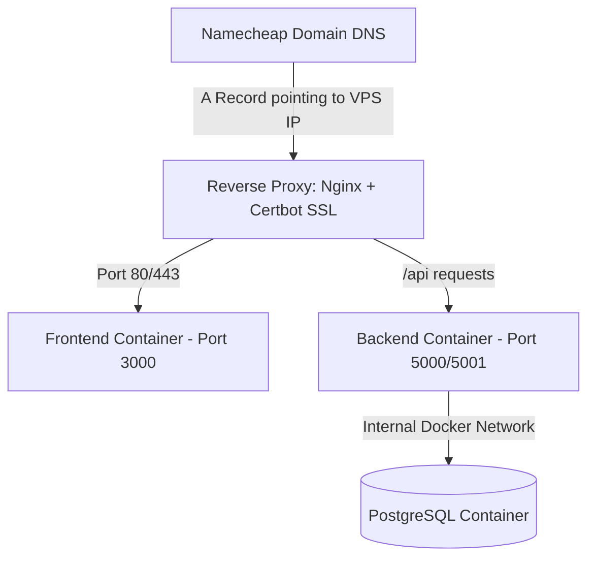

### 1. Direct Answers to Your Questions

- **Shared Hosting (cPanel) vs. VPS:**
  - **Choose VPS.** Shared cPanel hosting is designed primarily for static HTML or PHP scripts. It **does not support running Docker containers**, custom background services, or running custom PostgreSQL instances natively with Docker. A VPS gives you full `root` administrative access, allowing you to run Docker smoothly.
- **Deploy individually vs. deploy existing architecture:**
  - You **can deploy your existing architecture as-is** using Docker Compose. You do not need to split or separate the frontend, backend, and PostgreSQL database into different servers or services.
- **Why VPS with Docker Compose is ideal:**
  - It guarantees that what runs on your local machine runs identically in production.
  - It provides maximum flexibility for scaling, adding cache layers (e.g., Redis), or adding background task workers in the future.

---

### 2. Namecheap VPS Deployment Roadmap

Here is the step-by-step guide to deploying your repository on a **Namecheap VPS** (recommended OS: **Ubuntu 22.04 LTS or 24.04 LTS**).



---

#### Step 1: Initial VPS Setup & Access

1. Once your Namecheap VPS is provisioned, you will receive your Server IP and `root` credentials.
2. Connect to your server via SSH:
   ```bash
   ssh root@YOUR_SERVER_IP
   ```
3. Update system packages:
   ```bash
   sudo apt update && sudo apt upgrade -y
   ```

---

#### Step 2: Install Git, Docker, and Docker Compose

Run the following commands on your VPS:

```bash
# Install Git
sudo apt install -y git curl

# Install Docker
curl -fsSL https://get.docker.com -o get-docker.sh
sudo sh get-docker.sh

# Verify Docker installation
docker --version
docker compose version
```

---

#### Step 3: Clone Your Repository & Set Environment Variables

1. Clone your project onto the server:
   ```bash
   cd /var/www  # Or your preferred directory
   git clone https://github.com/YOUR_USERNAME/bakery-app.git
   cd bakery-app
   ```
2. Create your production `.env` file from `.env.example`:
   ```bash
   cp .env.example .env
   nano .env
   ```
3. Update `.env` with strong production values:
   ```env
   POSTGRES_USER=bakery_prod_user
   POSTGRES_PASSWORD=UseAStrongRandomPasswordHere!
   POSTGRES_DB=bakery_prod_db
   SECRET_KEY=GenerateAStrongProductionSecretKey
   JWT_SECRET_KEY=GenerateAnotherStrongJwtSecretKey
   FLASK_ENV=production
   APP_NAME=Bakery App
   ```

---

#### Step 4: Configure Domain DNS

In your Namecheap Domain Dashboard:

1. Go to **Advanced DNS**.
2. Add an **A Record**:
   - **Host:** `@` (or `www` / your subdomain)
   - **Value:** `YOUR_VPS_IP_ADDRESS`
   - **TTL:** Automatic

---

#### Step 5: Setup Nginx Reverse Proxy & SSL (HTTPS)

To expose your web application securely on standard HTTP (80) / HTTPS (443) ports with SSL:

1. Install Nginx and Certbot:
   ```bash
   sudo apt install -y nginx certbot python3-certbot-nginx
   ```
2. Create an Nginx configuration file for your site:
   ```bash
   sudo nano /etc/nginx/sites-available/bakery
   ```
3. Add the configuration:

   ```nginx
   server {
       server_name yourdomain.com www.yourdomain.com;

       location / {
           proxy_pass http://localhost:3000; # Points to Frontend Container
           proxy_http_version 1.1;
           proxy_set_header Upgrade $http_upgrade;
           proxy_set_header Connection 'upgrade';
           proxy_set_header Host $host;
           proxy_cache_bypass $http_upgrade;
       }

       location /api/ {
           proxy_pass http://localhost:5001/; # Points to Backend Container
           proxy_set_header Host $host;
           proxy_set_header X-Real-IP $remote_addr;
           proxy_set_header X-Forwarded-For $proxy_add_x_forwarded_for;
           proxy_set_header X-Forwarded-Proto $scheme;
       }
   }
   ```

4. Enable the site and restart Nginx:
   ```bash
   sudo ln -s /etc/nginx/sites-available/bakery /etc/nginx/sites-enabled/
   sudo nginx -t
   sudo systemctl reload nginx
   ```
5. Generate free SSL certificates via Let's Encrypt:
   ```bash
   sudo certbot --nginx -d yourdomain.com -d www.yourdomain.com
   ```

---

#### Step 6: Start Your Containers

Run Docker Compose in detached mode:

```bash
docker compose up -d --build
```

You can view container statuses and logs anytime:

```bash
docker compose ps
docker compose logs -f
```

---

### 3. Key Recommendations for Production

Before launching live, consider making these small updates to your setup:

1. **Volume Mounts in Production:**
   In [docker-compose.yml](file:///home/chafi/bakery-app/docker-compose.yml), live code volume mounts (e.g., `./backend:/app`) are helpful in local development, but on production, containers should run off compiled/built image code without live local file overrides.
2. **Frontend Production Build:**
   Currently [frontend/Dockerfile](file:///home/chafi/bakery-app/frontend/Dockerfile#L13) runs `npm run dev` (Vite dev server). For production, building static Vite files served via Nginx or a Node production server is faster and consumes far less memory on the VPS.
3. **Database Security:**
   In [docker-compose.yml](file:///home/chafi/bakery-app/docker-compose.yml#L11-L12), port `"5432:5432"` exposes Postgres to the public internet if the server firewall isn't active. In production, remove `"5432:5432"` so Postgres is only reachable internally by the `backend` container via the internal Docker network.
