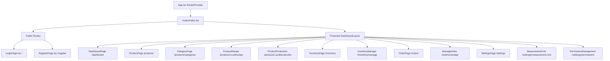

# Bakery App Frontend Architecture & Development Brain

This document serves as a dedicated guide and "brain" for the React frontend application, outlining its structures, design systems, workflows, and extension roadmaps for future developers and AI agents.

---

## 1. Core Stack & Configuration

The client is built as a single-page application (SPA) with:
- **Core**: **React 18** with **TypeScript** and **Vite**.
- **Styling**: **TailwindCSS** for layouts and style tokens.
- **UI primitives**: **shadcn/ui** (utilizing Radix UI under the hood) located in [components/ui/](file:///home/chafi/bakery-app/frontend/src/components/ui).
- **Notifications**: **React-Toastify** for UI alert prompts.
- **Iconography**: **Lucide React**.

---

## 2. Directory Layout

The frontend code resides in [frontend/src/](file:///home/chafi/bakery-app/frontend/src):
```
frontend/src/
├── components/
│   ├── layout/       # Layout structures (Sidebar, Navbar, DashboardLayout)
│   └── ui/           # Radix/shadcn wrapper components (Table, Button, etc.)
├── config/
│   └── constants.ts  # Global variables (API_BASE_URL, APP_NAME)
├── lib/
│   └── utils.ts      # Class merging helper (cn)
├── pages/            # View pages grouped by feature
│   ├── auth/         # Login & registration views
│   ├── dashboard/    # Main landing overview
│   ├── inventory/    # Stock logs & transaction adjustments
│   ├── orders/       # Order tracking & receipt printing
│   ├── products/     # Products management, recipes, and bakes
│   └── settings/     # Measurements units & role permissions
├── routes/           # Router mappings
│   ├── index.tsx     # Router compilation point
│   └── *Routes.tsx   # Feature-specific routes
├── App.tsx           # RouterProvider provider root
└── main.tsx          # DOM Mounting point & global stylesheets
```

---

## 3. Client-Side Routing & View Structure

Routing is managed via **React Router DOM v6** (data router layout) defined in the [routes directory](file:///home/chafi/bakery-app/frontend/src/routes):



---

## 4. Auth Session & API Communication

### 4.1. Session Storage
User sessions are verified client-side using `localStorage`. Upon successful login, the following keys are written:
- `token`: The raw JWT bearer token string.
- `user`: JSON-stringified object containing user attributes:
  ```json
  {
    "uuid": "string",
    "username": "string",
    "role": "admin | manager | staff | normal",
    "status": "approved | active | inactive"
  }
  ```

### 4.2. API Integration Pattern
API calls are performed using standard browser `fetch` statements pointing to configuration targets defined in [constants.ts](file:///home/chafi/bakery-app/frontend/src/config/constants.ts):
- Header token submission:
  ```typescript
  headers: {
    "Content-Type": "application/json",
    "Authorization": `Bearer ${localStorage.getItem('token')}`
  }
  ```

---

## 5. Specialized Frontend Workflows

### 5.1. Insufficient Stock Warning UI (Production Page)
When bakes are logged, the backend responds with a `422 Unprocessable Entity` if inventory stocks are too low to fulfill the recipe requirements:
- The page [ProductProduction.tsx](file:///home/chafi/bakery-app/frontend/src/pages/products/ProductProduction.tsx) catches this status code and parses the `data.shortfalls` list.
- It displays a red warning table detailing the missing ingredients, quantities required, quantities available, and the calculated shortfall.

### 5.2. POS Receipt Printing (Orders Log Page)
The order log [ManageOrder.tsx](file:///home/chafi/bakery-app/frontend/src/pages/orders/ManageOrder.tsx) handles order printing using a CSS stylesheet focused on **80mm thermal receipt printers**:
- The print layout is hidden during normal viewport view.
- In print mode (`@media print`), all main viewport wrappers (Navbar, Sidebar, Tables, Modals) are set to `visibility: hidden`.
- Only the specific `#printable-receipt` block is rendered as visible at position `0, 0` with a width of `80mm` and a monospace format.

---

## 6. Recommendations & Roadmap for Frontend Extensions

When implementing new client features:
1. **Centralize HTTP requests**: Replace the verbose fetch calls in pages with a single HTTP helper class or Axios instance.
2. **Add Router Route Guards**: Implement a wrapper router component that inspects the token availability before mounting `DashboardLayout` views.
3. **Role-Based UI Rendering**: Restrict menu items in the Sidebar (such as settings, user management, and inventory configurations) by matching `user.role` from the logged-in session.
